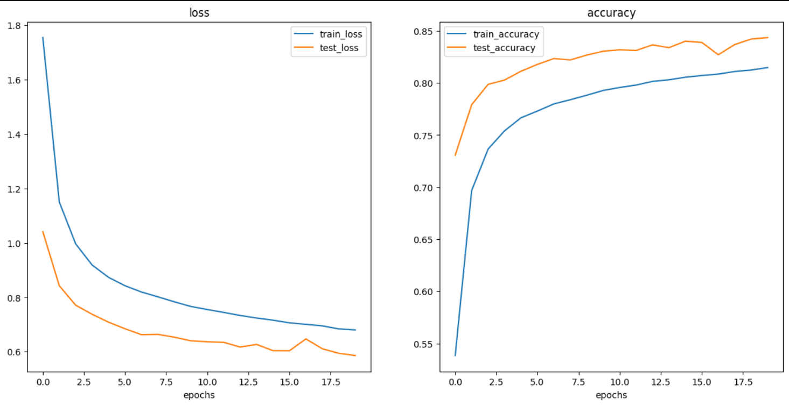
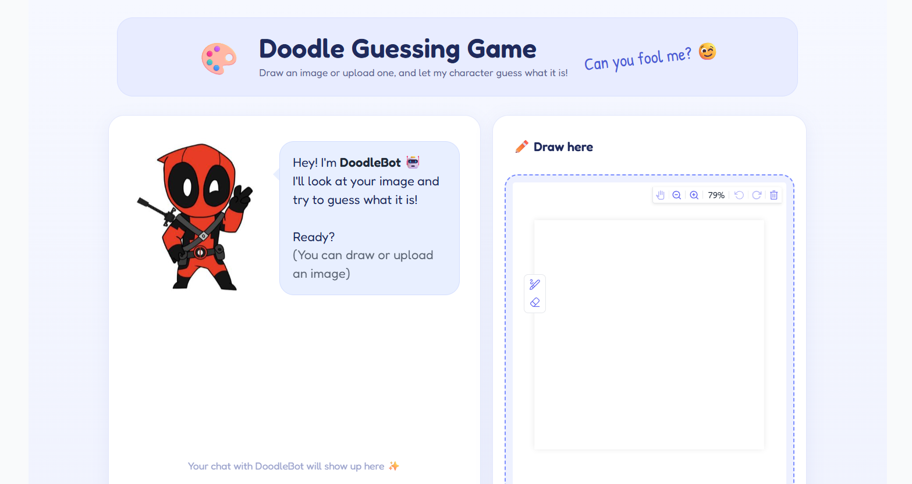
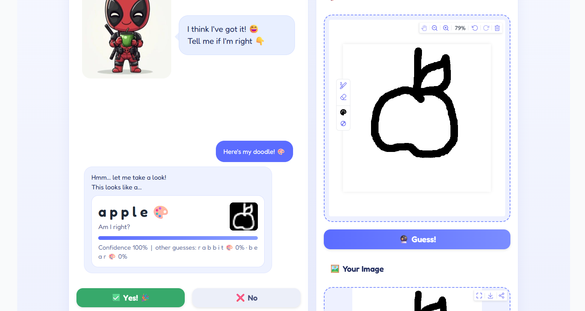
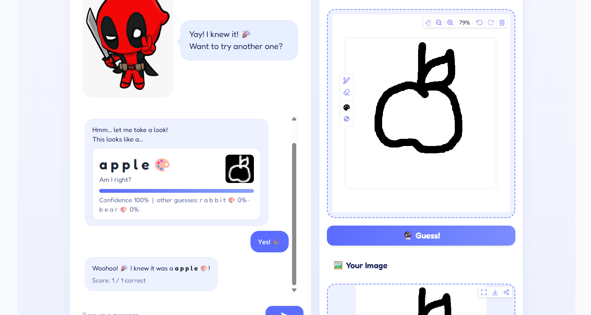

## DOODLE GUESSING IMAGE CLASSIFIER

A simple image classification project that can recognize hand-drawn
doodles.

## PROJECT OVERVIEW

This project is a doodle guessing game built using a custom image
classification model in PyTorch.

The main idea is simple: the user draws something on the screen, and the
model tries to guess what it is. The application shows the predicted
class along with the confidence score, and it can also show the top
three predictions.

For this project, I used selected categories from the Google Quick,
Draw! dataset and trained different models to see which approach worked
best. Instead of directly choosing one model, I first built a baseline
CNN, improved it with data augmentation and more capacity, and then
compared it with a pretrained EfficientNet model.

After comparing the results, I selected the improved CNN because it gave
the best accuracy while staying small and fast enough for an interactive
application.

## DATASET

The dataset used for this project is based on the Google Quick, Draw!
dataset.

The original dataset contains 345 categories. For this project, I
selected 45 categories and used 5,000 samples from each category.

Total images: 225,000

Training images: 180,000

Testing images: 45,000

Image size: 28 x 28 pixels

Image type: Grayscale

The 45 categories used are:

cat, tiger, lion, dog, bear, rabbit, horse, elephant, giraffe,
butterfly, fish, snake, whale, dolphin, shark, apple, pear, banana,
pizza, ice cream, donut, birthday cake, hamburger, bicycle, car, bus,
airplane, chair, clock, umbrella, light bulb, scissors, guitar, key,
sun, moon, cloud, tree, star, eye, hand, shoe, hat, house, smiley face

## DATASET SAMPLE

Hera are some sample images from the datasets.

## MODEL DEVELOPMENT

I trained and compared three different approaches.

The purpose was not only to get a high accuracy, but also to understand
how different model choices affected the results.

### MODEL 0 - BASELINE CNN

The first model was a basic TinyVGG-style convolutional neural network.

It contains two convolution blocks followed by a fully connected layer.

The model was trained for 10 epochs without data augmentation.

Results:

Test accuracy: 78.4% Test loss: 0.824 Best epoch: 10

The baseline model worked reasonably well, but there was still room for
improvement.

### MODEL 1 - IMPROVED CNN

For the second model, I kept the same general CNN idea but increased the
number of hidden units and added data augmentation.

The training images were randomly rotated and slightly translated during
training. This helped the model see different versions of the same type
of drawing instead of always seeing the drawings in exactly the same
position.

The model was trained for 20 epochs.

Results:

Test accuracy: 84.4% Test loss: 0.586 Best epoch: 20

This was the best-performing model out of the three.

The training and testing curves also showed that the model was learning
consistently. The curves started to flatten towards the later epochs, so
the model was getting closer to its current performance limit.

## MODEL 1 TRAINING CURVES

The training and testing loss and accuracy curves are shown below.

### MODEL 2 - TRANSFER LEARNING

For the third experiment, I tried transfer learning using a pretrained
EfficientNet-B0 model.

The pretrained feature layers were frozen and the final classifier was
replaced with a classifier for the 45 doodle categories.

The model was trained for 5 epochs.

Results:

Test accuracy: 77.9% Test loss: 0.802 Best epoch: 5

In this project, transfer learning did not improve the results.

One possible reason is that EfficientNet-B0 was originally trained on
natural images, while Quick, Draw! images are simple black-and-white
line drawings. The features learned from natural images were not as
useful for this particular dataset.

The transfer learning model was also much heavier and slower compared
with the small CNN used in the final application.

## MODEL COMPARISON

Model 0 - Baseline CNN Test accuracy: 78.4% Test loss: 0.824 Epochs: 10

Model 1 - Improved CNN Test accuracy: 84.4% Test loss: 0.586 Epochs: 20

Model 2 - EfficientNet-B0 Transfer Learning Test accuracy: 77.9% Test
loss: 0.802 Epochs: 5

Based on the results, Model 1 was selected as the final model.

### FINAL MODEL

The final application uses Model 1, the improved TinyVGG-style CNN.

The model has two convolution blocks and uses 32 hidden units. The
training pipeline also uses image augmentation with random rotation and
translation.

I selected this model because it gave the highest test accuracy among
the three experiments and is still small enough to run quickly for an
interactive application.

The trained model is saved as:

models/DOODLE_MODEL_1.pth

The class names are stored in:

models/class_names.json

GRADIO APPLICATION

The trained model was connected to a Gradio interface to turn the
project into an interactive doodle guessing game.

The user can draw or upload an image, and the application processes the
image before sending it to the model.

The application then displays:

-   Predicted class
-   Confidence score
-   Top 3 predictions
-   A simple feedback option
-   Different character images depending on the interaction

The application also contains a feedback system that can record whether
the prediction was correct.

APPLICATION SCREENSHOTS

## MAIN INTERFACE

This is a main interface of the doodle guessing application.

## PREDICTION

The application displays the predicted class, confidence score and top prediction.

## FEEDBACK

The application also allows the user to provide feedback on the prediction.

TECHNOLOGIES USED

Python PyTorch Torchvision Gradio NumPy Pillow Matplotlib Seaborn

## PROJECT STRUCTURE

Doodle_Guessing_Image_Classifier/

    app.py
    requirements.txt
    README.md
    doodle_classification.ipynb

    models/
        DOODLE_MODEL_1.pth
        class_names.json

    characters/
        Happy.jpeg
        Thinking.jpeg
        Smile.jpeg
        Celebrate.jpeg
        confused.jpeg

    screenshots/
        dataset_sample_1.png
        dataset_sample_2.png
        model1_curves.png
        main_interface.png
        prediction.png
        feedback.png

### NOTE ABOUT THE DATASET

The full dataset is not included in this repository because it contains
a large number of images.

The notebook contains the data preparation and model training process
used for the project.

HOW TO RUN THE PROJECT

1.  Clone the repository.

2.  Install the required packages:

pip install -r requirements.txt

3.  Make sure the model files are inside the “models” folder.

4.  Run the Gradio application:

python app.py

5.  Open the Gradio interface in the browser and start drawing.

REQUIREMENTS

The main packages required for the application are:

gradio torch pillow numpy

LIVE DEMO

The Gradio application can be deployed using Hugging Face Spaces.

Add the live demo link here after deployment.

Live Demo: [ADD YOUR HUGGING FACE SPACE LINK HERE]

NOTEBOOK

The complete training and experimentation process is included in:

doodle_classification.ipynb

The notebook contains the dataset preparation, model experiments,
training, evaluation and comparison of the different approaches.

WHAT I LEARNED

This project helped me understand the complete workflow of an image
classification project instead of only training a model.

Some of the main things I worked with were:

-   Preparing and organizing image data
-   Creating training and testing datasets
-   Applying image transformations
-   Building CNN models using PyTorch
-   Training and evaluating image classification models
-   Comparing different model architectures
-   Using data augmentation
-   Trying transfer learning
-   Looking at loss and accuracy curves
-   Creating a confusion matrix and checking predictions
-   Saving and loading a trained PyTorch model
-   Connecting a trained model to a Gradio application
-   Preparing a machine learning project for deployment

FUTURE IMPROVEMENTS

Some things I would like to improve in the future are:

-   Add more doodle categories
-   Increase the number of training images
-   Improve the preprocessing of user drawings
-   Try other CNN architectures
-   Experiment with different augmentation techniques
-   Improve the user interface
-   Add better feedback analysis
-   Improve the model’s performance on drawings that are very different
    from the training data

ACKNOWLEDGEMENTS

The project uses data based on the Google Quick, Draw! dataset.

I also used PyTorch and Gradio while developing and deploying the
project.

AI tools were used as development assistance during the implementation
and application-building process.

AUTHOR

Shivatej

B.Sc. Data Science

GitHub: [https://github.com/shivatej2624]

LinkedIn: [https://www.linkedin.com/in/shivatej-kanthi-94a20434a?utm_source=share_via&utm_content=profile&utm_medium=member_android]
